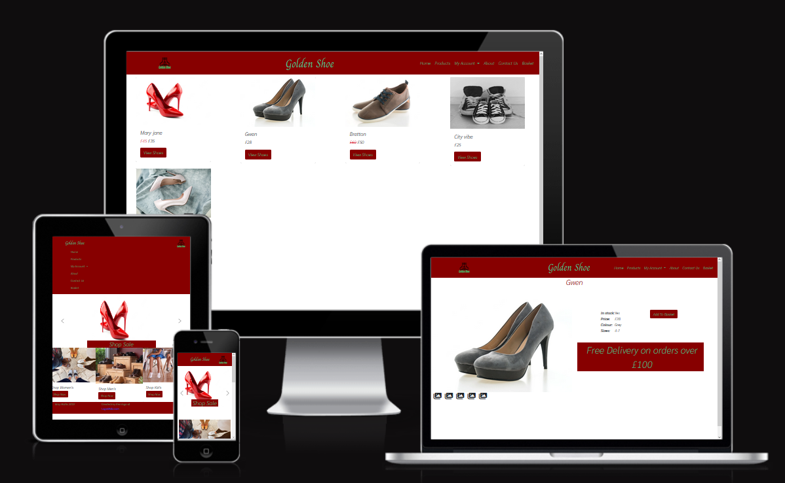

# Golden Shoe - AND Digital technical interview

## [Golden Shoe - Amy Hollis](https://golden-shoe-amy-hollis.herokuapp.com/)

This is an MVP (minimum viable product) for the Golden Shoe task set by AND Digital, to show the client what sort of solutions can be offered by AND Digital. Because this is only for demonstration purposes not all functionality has been added. 

### Viewing the product on a mobile device
This is a website that has been made to be responsive to different screen sizes, in order to help Golden Shoe stop seeing a dropout of mobile and tablet users. If you are not using a mobile device to view the site, open it in your browser and press crtl, shift + m to emulate mobile and tablet devices.

### Working Pages
From the landing page you can click on the 'shop sale' banner and on the shop department cards to be redirected to the products page witht the relevant filters on (please note there are only 5 items in the data base), from here you can click on the button for any of the products and go to the product detail page. In addition the home and products options on the navbar work, but the others do not. In addition the add to basket button has no fuctionality in this demonstration.

### Choice of technologies used for MVP
For the MVP I have used the Python framework Flask, this is because it is lightweight and simple to set up. As I decided to use Flask, I opted to use MongoDB with it as I wanted something quick to setup and I have used these two together before so know how they interacted. In addition I have used the css libary Bootstrap as this speeds up development time and the grid layout enabled me to easily change the layout of the page depending on the screen size. Furthermore, to save on the complexity of the MVP and the time taken to deploy, licence free photos have been used from freepik and the urls have been added to load from there, for a larger scale, more functional site I would look to use a cloud service such as AWS.

### Style changes in final product
I took the colour scheme from the image in the instructions, and took them to be the brand colours, so decided to stick with them. The main differences between here and what you would see in the final product would be on the product detail page, here there would be an ability to select a colour, size and quantity to add to the basket, however, as this is an MVP, I have only added the basic information I had added to the datasets. 